# Elixir runs in your browser. No server. No install.

Run Elixir code directly in your browser. No server required. No installation needed.

## Demo

https://elixir-browser-eval.torifuku-kaiou.app/

## What is WebAssembly (Wasm)?

WebAssembly is a binary instruction format that runs in modern browsers at near-native speed. It allows languages like C, Rust, and now Elixir to run in the browser alongside JavaScript.


## How it works

```mermaid
flowchart TB
    subgraph Browser
        UI[textarea + button]
        Popcorn[Popcorn JS ↔ Wasm Bridge]
        AtomVM[AtomVM WebAssembly]
        Eval[Code.eval_string/3]
        
        UI -->|code input| Popcorn
        Popcorn -->|call| AtomVM
        AtomVM --> Eval
        Eval -->|result| Popcorn
        Popcorn -->|display| UI
    end
```



This project uses:
- **[Popcorn](https://github.com/software-mansion/popcorn)** - A library to run Elixir in browsers via WebAssembly
- **[AtomVM](https://github.com/atomvm/AtomVM)** - A lightweight Erlang VM for microcontrollers and WebAssembly

## Build

This repository contains pre-built artifacts from [Popcorn](https://github.com/software-mansion/popcorn).

```bash
git clone https://github.com/software-mansion/popcorn.git
cd popcorn

# Trust mise configuration (required for cloned repositories)
mise trust

# Install required versions (OTP 26.0.2 and Elixir 1.17.3)
mise install

cd examples/eval_in_wasm
mix deps.get
mix popcorn.cook
```

The `static/` directory is deployed to Cloudflare Pages as-is.

## Credits

- [Popcorn](https://github.com/software-mansion/popcorn) by [Software Mansion](https://swmansion.com/)
- [AtomVM](https://github.com/atomvm/AtomVM)
